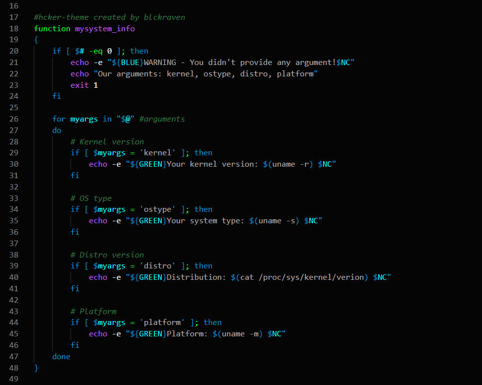

  

<h2 align="center">Hcker Theme</h2>
<h5 align="center">Light version: < a href="https://github/blckraven/vscode-lighty-theme">here</a> </h5>
<h5 align="center">VSCode Marketplace: < a href="https://marketplace.visualstudio.com/items?itemName=blckraven.hcker-theme">Hcker Theme</a> </h5>

Dark & modern theme for Your code.

